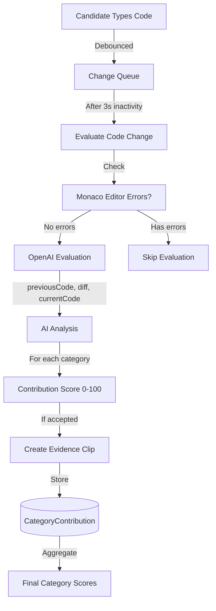
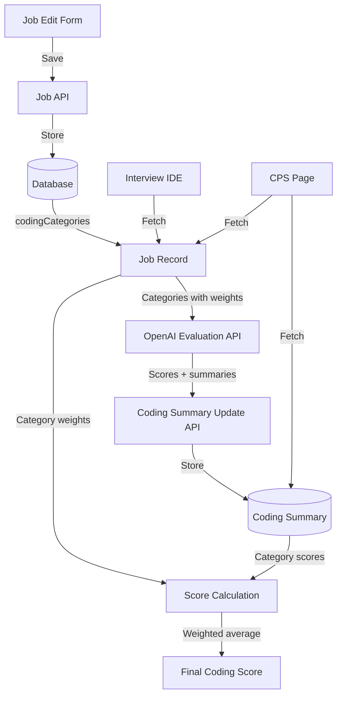

# Job-Specific Coding Categories

## Overview

The Job-Specific Coding Categories system allows companies to define custom evaluation criteria for coding interviews that align with specific job requirements. The system provides **real-time evaluation** of code changes during the interview, creating evidence clips with video timestamps that hiring managers can review later.

## Real-Time Evaluation System

### Architecture Overview



### How It Works

1. **Code Monitoring**: System monitors code changes in real-time
2. **Throttling**: Waits for 3 seconds of inactivity (configurable via `NEXT_PUBLIC_CODE_EVALUATION_THROTTLE_MS`)
3. **Error Checking**: Uses Monaco editor's built-in error detection to skip syntactically invalid code
4. **Evaluation**: Sends `previousCode`, `diff`, and `currentCode` to OpenAI for focused analysis
5. **Contribution Tracking**: Each meaningful change creates a `CategoryContribution` record
6. **Evidence Clips**: Accepted contributions generate video evidence clips with timestamps
7. **Aggregation**: Final scores calculated from all contributions at interview end

### Database Schema

**CategoryContribution Model** (NEW)
```prisma
model CategoryContribution {
  id                  String   @id @default(cuid())
  interviewSessionId  String
  categoryName        String   // "TypeScript Proficiency"
  timestamp           DateTime // Exact moment of code change
  codeChange          String   // The actual diff
  explanation         String   // What was contributed
  contributionStrength Int     // 0-100
  caption             String   // For video evidence
  createdAt           DateTime @default(now())
  
  interviewSession    InterviewSession @relation(fields: [interviewSessionId], references: [id], onDelete: Cascade)
  
  @@index([interviewSessionId, categoryName])
}
```

**EvidenceClip Model** (UPDATED)
```prisma
model EvidenceClip {
  // ... existing fields
  category            EvidenceCategory
  categoryName        String?  // "TypeScript Proficiency" for JOB_SPECIFIC_CATEGORY or EXPERIENCE_CATEGORY
  contributionStrength Int?    // 0-100 for dynamic category contributions
}

enum EvidenceCategory {
  AI_ASSIST_USAGE         // External tool usage (paste detection)
  EXTERNAL_TOOL_USAGE     // Same as above (legacy)
  JOB_SPECIFIC_CATEGORY   // Dynamic coding categories from job config
  EXPERIENCE_CATEGORY     // Dynamic experience categories from job config
}
```

**Job Model** (`server/prisma/schema.prisma`)
```prisma
model Job {
  // ... existing fields
  codingCategories Json?  // Array of {name, description, weight}
}
```

The `codingCategories` field stores an array of category objects:
```json
[
  {
    "name": "TypeScript Proficiency",
    "description": "Type safety, interfaces, generics usage",
    "weight": 33
  },
  {
    "name": "React Best Practices",
    "description": "Component composition, hooks usage, lifecycle management",
    "weight": 33
  },
  {
    "name": "Performance Optimization",
    "description": "Code splitting, lazy loading, rendering optimization",
    "weight": 34
  }
]
```

**CodingSummary Model** (`server/prisma/schema.prisma`)
```prisma
model CodingSummary {
  // ... existing fields
  jobSpecificCategories Json?  // Enriched evaluation results
}
```

The `jobSpecificCategories` field now stores:
```json
{
  "TypeScript Proficiency": {
    "score": 85,
    "text": "Demonstrates strong understanding of TypeScript...",
    "description": "Type safety, interfaces, generics usage",
    "evidenceLinks": [1245, 1892, 2103],  // Video timestamps in seconds
    "contributions": [
      {
        "timestamp": "2024-01-15T10:23:45Z",
        "strength": 80,
        "explanation": "Added proper type annotations to API response"
      },
      {
        "timestamp": "2024-01-15T10:25:12Z",
        "strength": 90,
        "explanation": "Implemented generic utility type for data fetching"
      }
    ]
  }
}
```

## Real-Time Evaluation API

### POST `/api/interviews/evaluate-code-change`

**File**: `app/api/interviews/evaluate-code-change/route.ts`

Evaluates incremental code changes in real-time, similar to how external tool usage evaluates answers contributing to topics.

**Input**:
```json
{
  "sessionId": "session_123",
  "previousCode": "const users = [];",
  "diff": "+const [users, setUsers] = useState([]);",
  "currentCode": "const [users, setUsers] = useState([]);",
  "timestamp": "2024-01-15T10:23:45Z",
  "jobCategories": [
    {"name": "React Best Practices", "description": "Hooks, composition"}
  ]
}
```

**OpenAI Prompt Strategy**:
```typescript
const prompt = `
You are a strict technical evaluator.

CODE BEFORE CHANGES:
${previousCode || ''}

CHANGES MADE (diff):
${diff}

CODE AFTER CHANGES (= before + diff applied):
${currentCode || ''}

Categories to evaluate:
${categoryList}

EVALUATION:
- ONLY credit NEW code in the + lines of the diff
- Use "CODE BEFORE" and "CODE AFTER" to understand context
- REJECT gibberish, incomplete syntax, or trivial changes

For EVERY category, return:
{
  "evaluations": [
    {
      "category": "Category Name",
      "reasoning": "Explain if the + lines add meaningful NEW code",
      "strength": 0-100,
      "accepted": true/false,
      "caption": "Brief description (only if accepted)"
    }
  ]
}
`;
```

**Output**:
```json
{
  "evaluations": [
    {
      "category": "React Best Practices",
      "reasoning": "Uses useState hook correctly for state management",
      "strength": 85,
      "accepted": true,
      "caption": "Added useState for users array"
    },
    {
      "category": "TypeScript Proficiency",
      "reasoning": "No type annotations added",
      "strength": 0,
      "accepted": false,
      "caption": null
    }
  ]
}
```

**Processing**:
1. For each **accepted** evaluation:
   - Create `CategoryContribution` record
   - Create `EvidenceClip` with `category: JOB_SPECIFIC_CATEGORY`
   - Create `VideoChapter` and `VideoCaption` for the evidence
2. Rejected evaluations logged in debug panel but not stored

### PATCH `/api/interviews/session/[sessionId]/coding-summary-update`

**File**: `app/api/interviews/session/[sessionId]/coding-summary-update/route.ts`

Updated to aggregate contributions when generating final scores.

**Process**:
```typescript
// 1. Fetch all contributions for session
const contributions = await prisma.categoryContribution.findMany({
  where: { interviewSessionId }
});

// 2. Group by category
const byCategory = contributions.reduce((acc, c) => {
  if (!acc[c.categoryName]) acc[c.categoryName] = [];
  acc[c.categoryName].push(c);
  return acc;
}, {});

// 3. Calculate average score per category
const jobSpecificCategories = {};
for (const [name, contribs] of Object.entries(byCategory)) {
  const avgScore = contribs.reduce((sum, c) => sum + c.contributionStrength, 0) / contribs.length;
  const evidenceLinks = contribs.map(c => calculateVideoOffset(c.timestamp));
  
  jobSpecificCategories[name] = {
    score: Math.round(avgScore),
    text: generateSummaryText(contribs),
    description: categoryDefinition.description,
    evidenceLinks,
    contributions: contribs.map(c => ({
      timestamp: c.timestamp,
      strength: c.contributionStrength,
      explanation: c.explanation
    }))
  };
}

// 4. Store enriched results
await prisma.codingSummary.update({
  data: { jobSpecificCategories }
});
```

## Code Change Monitoring

**File**: `app/(features)/interview/components/InterviewIDE.tsx`

### State Management
```typescript
const CODE_EVALUATION_THROTTLE_MS = Number(process.env.NEXT_PUBLIC_CODE_EVALUATION_THROTTLE_MS);
if (!CODE_EVALUATION_THROTTLE_MS) {
  throw new Error("NEXT_PUBLIC_CODE_EVALUATION_THROTTLE_MS environment variable is required");
}

const [previousCode, setPreviousCode] = useState(job.codingTemplate);
const [codeChangeQueue, setCodeChangeQueue] = useState<Array<{
  timestamp: Date;
  code: string;
  previousCode: string;
}>>([]);
const evaluationTimeoutRef = useRef<NodeJS.Timeout | null>(null);
```

### Change Detection
```typescript
const handleCodeChange = (newCode: string) => {
  if (!isCodingStarted || !job?.codingCategories) return;
  
  const changeTimestamp = new Date();
  
  // Add to queue
  setCodeChangeQueue(prev => [...prev, {
    timestamp: changeTimestamp,
    code: newCode,
    previousCode: previousCode
  }]);
  
  // Clear existing timeout
  if (evaluationTimeoutRef.current) {
    clearTimeout(evaluationTimeoutRef.current);
  }
  
  // Set new timeout
  const evaluationTime = new Date(Date.now() + CODE_EVALUATION_THROTTLE_MS);
  setNextEvaluationTime(evaluationTime);
  
  evaluationTimeoutRef.current = setTimeout(() => {
    evaluateCodeChange();
  }, CODE_EVALUATION_THROTTLE_MS);
};
```

### Evaluation Logic
```typescript
const evaluateCodeChange = async () => {
  setCodeChangeQueue(currentQueue => {
    if (currentQueue.length === 0) return [];
    
    const firstChange = currentQueue[0];
    const lastChange = currentQueue[currentQueue.length - 1];
    
    // Check for Monaco editor errors
    const editor = editorInstanceRef.current;
    if (editor) {
      const model = editor.getModel();
      if (model) {
        const markers = monaco.editor.getModelMarkers({ resource: model.uri });
        const errors = markers.filter(m => m.severity === monaco.MarkerSeverity.Error);
        
        if (errors.length > 0) {
          logger.info("❌ Skipping evaluation - code has syntax errors");
          return []; // Clear queue but don't evaluate
        }
      }
    }
    
    // Generate diff
    const diff = generateDiff(firstChange.previousCode, lastChange.code);
    
    // Call evaluation API
    await fetch('/api/interviews/evaluate-code-change', {
      method: 'POST',
      body: JSON.stringify({
        sessionId: interviewSessionId,
        previousCode: firstChange.previousCode,
        diff,
        currentCode: lastChange.code,
        timestamp: firstChange.timestamp,
        jobCategories: job.codingCategories
      })
    });
    
    setPreviousCode(lastChange.code);
    return []; // Clear queue
  });
};
```

## Evidence Clip Generation

Similar to external tool evaluation, job-specific contributions create evidence clips that hiring managers can review.

**Video Chapter Creation**:
```typescript
// For each accepted contribution
const evidenceClip = await prisma.evidenceClip.create({
  data: {
    interviewSessionId,
    category: 'JOB_SPECIFIC_CATEGORY',
    categoryName: contribution.category,
    contributionStrength: contribution.strength,
    timestamp: contribution.timestamp,
    caption: contribution.caption
  }
});

const videoChapter = await prisma.videoChapter.create({
  data: {
    interviewSessionId,
    title: `${contribution.category}: ${contribution.caption}`,
    startTime: calculateVideoOffset(contribution.timestamp)
  }
});

await prisma.videoCaption.create({
  data: {
    videoChapterId: videoChapter.id,
    text: contribution.explanation,
    timestamp: calculateVideoOffset(contribution.timestamp)
  }
});
```

### Data Flow



## Key Features

### Incremental Contribution Model

Unlike the legacy system that evaluated code only at submission, the new system:

1. **Tracks Every Meaningful Change**: Monitors code as candidate types
2. **Evaluates Incrementally**: Each code change evaluated for category contributions
3. **Creates Evidence Trail**: Every accepted contribution generates video evidence
4. **Aggregates Fairly**: Final scores averaged from all contributions, not single evaluation

**Analogy**: Similar to how external tool evaluation judges individual answers contributing to topics, job-specific evaluation judges individual code changes contributing to categories.

### Monaco Editor Integration

**Error Prevention**:
```typescript
const markers = monaco.editor.getModelMarkers({ resource: model.uri });
const errors = markers.filter(m => m.severity === monaco.MarkerSeverity.Error);

if (errors.length > 0) {
  logger.info("❌ Skipping evaluation - code has syntax errors");
  return; // Don't waste API calls on invalid code
}
```

**Benefits**:
- Saves OpenAI API costs
- Prevents false negatives from syntax errors
- Candidate can fix errors before evaluation
- Debug panel shows when/why evaluations skipped

### Timestamp Accuracy

**Challenge**: With 3-second throttling, which timestamp to use for evidence?

**Solution**: Queue captures exact timestamp of each keystroke, API call uses **earliest timestamp** from batch:

```typescript
const firstChange = codeChangeQueue[0]; // Earliest timestamp
const lastChange = codeChangeQueue[codeChangeQueue.length - 1]; // Latest code

await evaluateCodeChange({
  timestamp: firstChange.timestamp, // <-- Ensures evidence accuracy
  currentCode: lastChange.code
});
```

**Result**: Evidence clips show the moment candidate **started** the contribution, not when evaluation ran.

### 1. Job Edit Form UI

**File**: `app/(features)/company-dashboard/jobs/[jobId]/page.tsx`

**Location**: Scoring Configuration > Coding Dimensions > Job-Specific Categories

**Features**:
- Add/edit/remove categories inline
- Real-time weight validation (must sum to 100%)
- Minimal, Apple-inspired card design
- Each category has:
  - Name (e.g., "TypeScript Proficiency")
  - Description (e.g., "Type safety, interfaces, generics usage")
  - Weight (percentage, 0-100)

**State Management**:
```typescript
const [codingCategories, setCodingCategories] = useState<CodingCategory[]>([]);

interface CodingCategory {
  name: string;
  description: string;
  weight: number;
}
```

### 2. Evaluation Pipeline

#### Step 1: Interview Submission
**File**: `app/(features)/interview/components/InterviewIDE.tsx`

When candidate submits code:
1. Fetch job-specific categories from `job.codingCategories`
2. Call `/api/interviews/evaluate-job-specific-coding` with:
   - `finalCode`: The candidate's submitted code
   - `codingTask`: The coding prompt
   - `categories`: Array from job definition

#### Step 2: OpenAI Evaluation
**File**: `app/api/interviews/evaluate-job-specific-coding/route.ts`

OpenAI evaluates each category:
```typescript
// Prompt structure
{
  systemPrompt: `
    Evaluate code against:
    - Category 1: Description
    - Category 2: Description
    
    Provide score (0-100) and 2-3 sentence explanation for each.
  `,
  model: "gpt-4o-mini",
  response_format: { type: "json_object" }
}
```

Returns:
```json
{
  "categories": {
    "Category Name": {
      "score": 85,
      "text": "Evaluation summary..."
    }
  }
}
```

#### Step 3: Store Results
**File**: `app/api/interviews/session/[sessionId]/coding-summary-update/route.ts`

Enriches results with descriptions and stores in `CodingSummary.jobSpecificCategories`:
```typescript
const enrichedCategories = {
  [categoryName]: {
    score: evaluationScore,
    text: evaluationText,
    description: categoryDefinition.description
  }
};
```

### 3. Score Calculation

**File**: `app/shared/utils/calculateScore.ts`

```typescript
interface RawScores {
  categoryScores: Array<{
    name: string;
    score: number;
    weight: number;
  }>;
}

// Calculate weighted average
const codingScore = sum(score × weight) / sum(weights)
```

**Example**:
- Category 1: score=80, weight=33% → 80 × 33 = 2640
- Category 2: score=70, weight=33% → 70 × 33 = 2310
- Category 3: score=90, weight=34% → 90 × 34 = 3060
- **Total**: (2640 + 2310 + 3060) / 100 = **80.1**

### 4. CPS Display

**File**: `app/(features)/cps/components/WorkstyleDashboard.tsx`

Now displays evidence links below each job-specific category, matching the pattern used for "External Tools Usage".

```typescript
{codingSummary?.jobSpecificCategories && Object.entries(codingSummary.jobSpecificCategories).map(([categoryName, categoryData]) => {
    return (
        <MetricRow
            key={categoryName}
            label={categoryName}
            description={(categoryData as any).description || "Job-specific coding evaluation"}
            value={categoryData.score}
            benchmarkLow={0}
            benchmarkHigh={100}
            evidenceLinks={(categoryData as any).evidenceLinks || []}
            onVideoJump={onVideoJump}
        />
    );
})}
```

**Evidence Links**:
- Displayed as clickable play buttons below each category
- Each link jumps to the video timestamp where the contribution was made
- Hiring manager can see candidate's face and thought process while coding
- Format: timestamps in seconds from recording start

**File**: `app/(features)/cps/page.tsx`

Fetches both job and coding summary to combine:
- Category definitions (from job)
- Category scores (from coding summary)
- Evidence links (from aggregated contributions)
- Calculates final score using weights

## Debug Panel

**File**: `app/(features)/interview/components/debug/CodingEvaluationDebugPanel.tsx`

### Global Control
Debug panel now controlled by a single button in the global header (not feature-specific subheaders).

**Location**: Header → Debug toggle button (purple icon)

**Implementation**: Uses `DebugContext` to synchronize visibility across:
- CPS page (`CPSDebugPanel`)
- Background interview page (`BackgroundDebugPanel`)
- Coding interview page (`CodingEvaluationDebugPanel`)

### Real-Time Contributions Tab

Shows live evaluation data during interview:

**Summary Stats**:
- Total Evaluations: Count of API calls made
- Total Contributions: Count of accepted evaluations
- Categories Hit: Unique categories with contributions
- Next Evaluation: Countdown timer (e.g., "2s" until next check)

**Category Breakdown**:
- Lists each category with contributions
- Average strength across all contributions
- Progress bar visualization
- Expandable list of individual contributions with timestamps

**Evaluation Timeline**:
- Chronological list of all evaluations
- For each evaluation:
  - Timestamp
  - Code diff sent to OpenAI
  - Full current code sent to OpenAI
  - All category evaluations (accepted and rejected)
  - Each evaluation shows:
    - Category name
    - Strength score (0-100)
    - Reasoning (why accepted or rejected)
    - Caption (if accepted)
    - Color-coded: Green for accepted, Red for rejected

**Configuration Display**:
- Throttle time read from `NEXT_PUBLIC_CODE_EVALUATION_THROTTLE_MS`
- Empty state message: "Click 'Test Evaluation' or start coding (updates every Xs of inactivity)"
- Test Evaluation button in header for manual testing

## Environment Configuration

```bash
# Required - no fallback allowed per constitution
NEXT_PUBLIC_CODE_EVALUATION_THROTTLE_MS=3000  # Milliseconds of inactivity before evaluation

# Existing
NEXT_PUBLIC_DEBUG_MODE=true
NEXT_PUBLIC_DEBUG_PANEL_VISIBLE=true
```

**Error Handling**:
```typescript
const throttleMs = Number(process.env.NEXT_PUBLIC_CODE_EVALUATION_THROTTLE_MS);
if (!throttleMs) {
  throw new Error("NEXT_PUBLIC_CODE_EVALUATION_THROTTLE_MS environment variable is required");
}
```

## Comparison: Job-Specific vs External Tool Evaluation

| Aspect | Job-Specific Categories | External Tool (Paste) Evaluation |
|--------|------------------------|----------------------------------|
| **Trigger** | Code change after inactivity | Paste event detected |
| **Evaluation Unit** | Code diff (incremental change) | Answer to interviewer question |
| **What's Evaluated** | Contribution to technical categories | Understanding of pasted concepts |
| **Scoring** | 0-100 per category per change | 0-100 per topic per answer |
| **Aggregation** | Average of all contributions | Average of all Q&A scores |
| **Evidence** | Video timestamp of coding moment | Video timestamp of answer |
| **Display in CPS** | MetricRow with evidenceLinks | MetricRow with evidenceLinks |
| **Impact on Score** | 75% of coding score (default) | 25% of coding score (default) |

**Shared Patterns**:
- Both use incremental evaluation (not single final judgment)
- Both create video evidence clips
- Both aggregate multiple evaluations into final score
- Both display evidence links in CPS using `MetricRow`
- Both track individual contributions for transparency

## Key Components

### 1. API Endpoints

#### GET `/api/company/jobs/[jobId]`
Returns job with `codingCategories` field.

#### POST `/api/interviews/evaluate-code-change` (NEW - Real-Time)
Evaluates incremental code changes during interview.

**Input**: `{ sessionId, previousCode, diff, currentCode, timestamp, jobCategories }`
**Output**: `{ evaluations: [{ category, reasoning, strength, accepted, caption }] }`

#### POST `/api/interviews/evaluate-job-specific-coding` (LEGACY)
Final evaluation at submission. Still used for "Test Evaluation" button in debug panel.

#### PATCH `/api/interviews/session/[sessionId]/coding-summary-update`
Now aggregates `CategoryContribution` records to calculate final scores with evidence links.

#### GET `/api/interviews/session/[sessionId]/coding-summary`
Returns coding summary including enriched `jobSpecificCategories` with evidence links and contribution history.

### 2. Job Edit Form UI
Returns job with `codingCategories` field.

**Helper**: `app/api/company/jobs/jobHelpers.ts`
```typescript
export function mapJobResponse(job) {
  return {
    // ... other fields
    codingCategories: job.codingCategories
  };
}
```

### POST `/api/interviews/evaluate-job-specific-coding`
Evaluates code against categories using GPT-4o.

**Input**:
```json
{
  "finalCode": "...",
  "codingTask": "...",
  "categories": [{name, description, weight}]
}
```

**Output**:
```json
{
  "categories": {
    "Category Name": {
      "score": 85,
      "text": "..."
    }
  }
}
```

### PATCH `/api/interviews/session/[sessionId]/coding-summary-update`
Updates `CodingSummary.jobSpecificCategories`.

**Input**:
```json
{
  "jobSpecificCategories": {
    "Category Name": {
      "score": 85,
      "text": "...",
      "description": "..."
    }
  }
}
```

### GET `/api/interviews/session/[sessionId]/coding-summary`
Returns coding summary including `jobSpecificCategories`.

### GET/POST `/api/interviews/session/[sessionId]/code-quality-analysis`
Returns/generates detailed analysis including job-specific categories.

## Extending the System

### Adding a New Job

1. Navigate to job edit form
2. Scroll to "Scoring Configuration" > "Coding Dimensions"
3. Click "+ Add Category"
4. Fill in:
   - Name: User-facing category name
   - Description: What the category measures
   - Weight: Percentage (must sum to 100% across all categories)
5. Save job

### Modifying Evaluation Logic

**To change OpenAI prompt**:
Edit `app/api/interviews/evaluate-job-specific-coding/route.ts`:
```typescript
const systemPrompt = `
  // Your custom evaluation instructions
  // Reference: ${categoryList}
`;
```

**To change scoring scale**:
Update scoring guidelines in the same file:
```typescript
**Scoring Guidelines:**
- 90-100: Your criteria
- 75-89: Your criteria
// ...
```

### Adding Category Presets

**File**: `server/db-scripts/seed-data.ts`

Add preset categories for different job types:
```typescript
const FRONTEND_CATEGORIES = [
  { name: "TypeScript Proficiency", description: "...", weight: 33 },
  { name: "React Best Practices", description: "...", weight: 33 },
  { name: "Performance Optimization", description: "...", weight: 34 }
];

const BACKEND_CATEGORIES = [
  { name: "API Design", description: "...", weight: 40 },
  { name: "Database Optimization", description: "...", weight: 30 },
  { name: "Security Practices", description: "...", weight: 30 }
];
```

### Customizing Display

**CPS Metric Rows**: Edit `app/(features)/cps/components/WorkstyleDashboard.tsx`

**Code Quality Modal**: Edit `app/(features)/cps/components/CodingSummaryOverlay.tsx`

## Migration from Legacy System

The system previously used hardcoded categories:
- `codeQualityWeight`: Fixed weight for code quality
- `problemSolvingWeight`: Fixed weight for problem solving
- Static categories defined in code

**Migration steps**:
1. Database migration added `codingCategories` to Job
2. Removed obsolete fields from schema
3. Updated scoring calculation to use dynamic weights
4. Deleted hardcoded constants file
5. Updated all UI components to display dynamic categories

**Backward Compatibility**:
- Jobs without `codingCategories`: Display shows no categories
- Evaluation APIs handle empty category arrays gracefully
- Score calculation defaults to 0 if no categories defined

## Debug Tools

### Debug Panel
**Location**: Main header (purple icon next to avatar)

Shows:
- **Coding Scores**: All job-specific category scores
- **Calculated Average**: Average of all category scores
- **Raw JSON**: Full `codingSummary.jobSpecificCategories` object

**File**: `app/(features)/cps/components/CPSDebugPanel.tsx`

### Interview Debug Panel
**Location**: Interview page, "Test Evaluation" button

Shows:
- Job-specific categories response
- Raw evaluation from OpenAI
- Individual category scores and texts

**File**: `app/(features)/interview/components/debug/CodingEvaluationDebugPanel.tsx`

## Validation Rules

1. **Category names**: Must be unique within a job
2. **Weights**: Must be positive numbers
3. **Weight sum**: Must equal 100%
4. **Minimum categories**: 1 (no maximum, but UI warns if > 10)
5. **Description**: Optional but recommended for clarity

## Performance Considerations

- **Database**: `Json` fields are efficient for flexible schemas
- **OpenAI API**: Single call evaluates all categories
- **Frontend**: Categories render dynamically without code changes
- **Caching**: Job definitions cached in interview session

## Future Enhancements

- Category templates/library
- AI-suggested categories based on job description
- Historical comparison of category effectiveness
- Category-specific remediation suggestions
- Multi-language support for category names/descriptions

