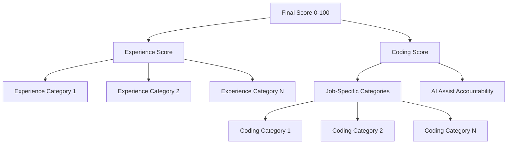

# Candidate Scoring System

## Overview

The scoring system evaluates candidates across two main dimensions: **Experience** and **Coding**. Each dimension is calculated independently with configurable weights, then combined into a final score (0-100).

## Score Architecture



## Formula

### Final Score
```typescript
finalScore = (
  (experienceScore × experienceWeight) +
  (codingScore × codingWeight)
) / (experienceWeight + codingWeight)
```

**Default weights**:
- `experienceWeight = 50%`
- `codingWeight = 50%`

### Experience Score
```typescript
experienceScore = sum(
  experienceCategory[i].score × experienceCategory[i].weight
) / sum(experienceCategory[i].weight)
```

**Categories**: Defined per job in `job.experienceCategories` JSON field

**Example categories**:
- Technical Depth & Problem-Solving (weight: 40)
- System Design & Architecture (weight: 30)
- Communication & Collaboration (weight: 30)

**Data source**: Background interview summary (AI-evaluated from conversation against job-defined categories)

### Coding Score
```typescript
codingScore = (
  sum(categoryScore[i] × categoryWeight[i]) +
  (aiAssistAccountability × aiAssistWeight)
) / (sum(categoryWeight[i]) + aiAssistWeight)
```

**Default weights**:
- Job-specific categories: Sum to 100% (e.g., 33%, 33%, 34%)
- `aiAssistWeight = 25%`

**Data sources**:
- Category scores: OpenAI evaluation of final code
- AI Assist: Paste evaluation Q&A performance

## Score Components

### Experience Categories (Dynamic)

**Configured per job** in `job.experienceCategories` JSON field. Each job defines custom experience areas that align with role requirements.

**Structure**:
```json
[
  {
    "name": "Technical Depth & Problem-Solving",
    "description": "Deep technical knowledge, complex problem decomposition, debugging",
    "weight": 40
  },
  {
    "name": "System Design & Architecture",
    "description": "Architectural decisions, scalability, design patterns",
    "weight": 30
  },
  {
    "name": "Communication & Collaboration",
    "description": "Technical communication, team collaboration, knowledge sharing",
    "weight": 30
  }
]
```

**Evaluation Process**:
1. Interviewer asks about concrete past projects
2. AI evaluates each answer against defined categories in real-time
3. Each meaningful response creates a `CategoryContribution` record (0-100 score)
4. Final category score = weighted average of all contributions for that category

**Scoring Scale (0-100 per contribution)**:
- **0**: Off-topic, evasive, or no relevant information
- **1-30**: Vague or superficial, minimal relevant content
- **31-60**: Basic competence with limited depth
- **61-80**: Clear demonstration with specific examples
- **81-100**: Exceptional depth with concrete examples and tradeoffs

### Coding Dimensions

#### Job-Specific Categories (Dynamic)

**Configured per job**. Example for Frontend Engineer:

**1. TypeScript Proficiency** (33%)
- Type safety usage
- Interface and generic design
- Advanced TypeScript features

**2. React Best Practices** (33%)
- Component composition
- Hooks usage and lifecycle
- State management patterns

**3. Performance Optimization** (34%)
- Code splitting
- Lazy loading
- Rendering optimization

**Scoring**: Each category evaluated independently by GPT-4o against final submitted code.

#### AI Assist Accountability (25%)

**Measures**: Understanding of pasted/AI-generated code

**Evaluation**: Interactive Q&A when paste detected
- Up to 4 key concepts identified from pasted code
- Candidate answers probing questions
- Average of topic coverage scores (0-100)

**Scoring criteria**:
- 90-100: Can explain all concepts in depth
- 75-89: Strong understanding of most concepts
- 60-74: Basic understanding, some gaps
- Below 60: Superficial or incorrect explanations

**N/A Handling**: If no paste events occur, AI Assist is excluded from calculation (shows as "N/A").

## Weight Configuration

### Database Model
```prisma
model ScoringConfiguration {
  jobId String @unique
  
  // Main dimension weights (must sum to 100)
  experienceWeight Float @default(50)
  codingWeight Float @default(50)
  
  // Workstyle metric weight (part of coding score)
  aiAssistWeight Float @default(25)
}

model Job {
  // ... other fields
  
  // Dynamic experience categories with weights
  experienceCategories Json?  // Array of {name, description, weight}
  
  // Dynamic coding categories with weights
  codingCategories Json?  // Array of {name, description, weight}
}
```

### Per-Job Configuration

Companies can configure categories and weights in the Job edit form:

**Scoring Configuration Section**:
1. **Main Weights**: Experience vs Coding split (must sum to 100%)
2. **Experience Categories**: Define custom categories with individual weights (must sum to 100%)
3. **Coding Categories**: Define job-specific coding criteria with individual weights (must sum to 100%)
4. **AI Assist Weight**: How much paste accountability contributes to coding score

**Validation**:
- Main dimension weights (experience + coding) must sum to 100%
- Within experience: category weights must sum to 100%
- Within coding: category weights must sum to 100%

## Calculation Implementation

**File**: `app/shared/utils/calculateScore.ts`

### Interface
```typescript
interface RawScores {
  // Experience category scores with weights
  experienceScores: Array<{
    name: string;
    score: number;
    weight: number;
  }>;
  // Coding category scores with weights
  categoryScores: Array<{
    name: string;
    score: number;
    weight: number;
  }>;
}

interface WorkstyleMetrics {
  aiAssistAccountabilityScore: number | null;
}

interface ScoringConfiguration {
  // Weights...
}
```

### Function
```typescript
export function calculateScore(
  rawScores: RawScores,
  workstyle: WorkstyleMetrics,
  config: ScoringConfiguration
): {
  finalScore: number;
  experienceScore: number;
  codingScore: number;
}
```

### Example Calculation

**Input**:
```typescript
rawScores = {
  experienceScores: [
    { name: "Technical Depth", score: 85, weight: 40 },
    { name: "System Design", score: 90, weight: 30 },
    { name: "Communication", score: 80, weight: 30 }
  ],
  categoryScores: [
    { name: "TypeScript", score: 75, weight: 33 },
    { name: "React", score: 80, weight: 33 },
    { name: "Performance", score: 70, weight: 34 }
  ]
};
workstyle = {
  aiAssistAccountabilityScore: 85
};
config = {
  experienceWeight: 50,
  codingWeight: 50,
  aiAssistWeight: 25
};
```

**Step 1: Experience Score**
```
= (85 × 40 + 90 × 30 + 80 × 30) / 100
= (3400 + 2700 + 2400) / 100
= 85
```

**Step 2: Coding Score**
```
Categories:
= (75 × 33 + 80 × 33 + 70 × 34) / 100
= (2475 + 2640 + 2380) / 100
= 75

With AI Assist:
= (75 × 100 + 85 × 25) / 125
= (7500 + 2125) / 125
= 77
```

**Step 3: Final Score**
```
= (85 × 50 + 77 × 50) / 100
= (4250 + 3850) / 100
= 81
```

## CPS Display

**File**: `app/(features)/cps/page.tsx`

### Score Breakdown Card
Shows:
- **Final Score**: Large number at top
- **Experience vs Coding**: Bar chart visualization
- Expandable breakdown of all components

### Coding Section
**File**: `app/(features)/cps/components/WorkstyleDashboard.tsx`

Shows each metric as a row:
1. Job-specific categories (dynamic)
   - Category name
   - Description
   - Score with visual indicator
2. External Tools Usage
   - AI Assist Accountability score or "N/A"
3. "View Analysis" button
   - Opens modal with detailed evaluation text

## Debug Tools

### CPS Debug Panel
**Location**: Purple icon in header (when DEBUG_MODE=true)

**Shows**:
- Raw scores for all components
- Calculated experience/coding scores
- Final score calculation
- All weights from configuration
- Full JSON data for debugging

**File**: `app/(features)/cps/components/CPSDebugPanel.tsx`

### Interview Debug Panel
**Location**: Interview page, "Test Evaluation" button

**Shows**:
- Real-time evaluation results
- API responses for each scoring component
- Paste evaluation Q&A history

## Edge Cases

### Missing Data

**No background summary**:
```typescript
experienceScore = null;
finalScore = codingScore;  // 100% from coding
```

**No coding summary**:
```typescript
codingScore = null;
finalScore = experienceScore;  // 100% from experience
```

**No AI assist data** (no paste events):
```typescript
aiAssistAccountabilityScore = null;
// Exclude from coding calculation
codingScore = sum(categoryScores) / totalCategoryWeight;
```

**No job-specific categories**:
```typescript
categoryScores = [];
codingScore = aiAssistAccountabilityScore;  // 100% from AI assist
```

### Zero Scores

**Zero is valid**: Represents poor performance, not missing data.

```typescript
if (score === 0) {
  // Include in calculation
}
if (score === null) {
  // Exclude from calculation
}
```

### Weight Validation

**Frontend validation**:
- Real-time sum display
- Warning if ≠ 100%
- Blocks save if invalid

**Backend validation**:
- API validates weight sums
- Returns 400 error if invalid
- Logs validation failures

## Historical Changes

### Removed Metrics (Jan 2026)

1. **Code Quality Weight**: Replaced by dynamic job categories
2. **Problem Solving**: Merged into job-specific categories
3. **Independence**: Removed (redundant with other metrics)
4. **Iteration Speed**: Removed (too noisy, hard to interpret)

**Migration**:
- Database migrations removed obsolete fields
- Scoring calculation updated to exclude
- UI components removed old displays
- Default weights adjusted to sum to 100%

### Weight Adjustments

**Before**:
- Code Quality: 50%
- AI Assist: 12.5%
- Problem Solving: 25%
- Independence: 12.5%

**After**:
- Job Categories: 75% (combined, then split by custom weights)
- AI Assist: 25%

## Best Practices

### For Companies

1. **Weight allocation**:
   - Prioritize most important skills
   - Balance between experience and coding
   - Adjust based on role seniority

2. **Category definition**:
   - Be specific in descriptions
   - Focus on measurable skills
   - Avoid overlapping categories

3. **Calibration**:
   - Review scores across multiple candidates
   - Adjust weights if needed
   - Consider industry benchmarks

### For Developers

1. **Adding new metrics**:
   - Add to appropriate model (Experience/Coding/Workstyle)
   - Update calculation function
   - Add UI display component
   - Include in debug panel

2. **Modifying weights**:
   - Update database defaults
   - Add migration for existing records
   - Update seed data
   - Test calculation edge cases

3. **Testing**:
   - Unit test calculation function
   - Test all N/A scenarios
   - Verify UI displays correctly
   - Check debug panel accuracy

## Future Enhancements

- Machine learning score normalization
- Historical percentile rankings
- Team-based scoring aggregations
- Custom formulas per company
- A/B testing different weight configurations
- Automated weight optimization based on hiring outcomes

