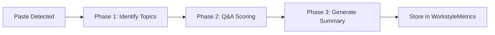

# External Tool Evaluation (Paste Detection & Accountability)

## Overview

The External Tool Evaluation system detects when candidates paste code during coding interviews and evaluates their understanding through an interactive Q&A process. This measures **AI Assist Accountability** - how well candidates can explain and defend pasted code.

## System Architecture

### Three-Phase Evaluation Pipeline



## Phase 1: Identify Topics

**Trigger**: Candidate pastes code (detected by clipboard event)

**API**: `/api/interviews/identify-paste-topics`

**File**: `app/api/interviews/identify-paste-topics/route.ts`

### Process

1. Extracts key concepts from pasted code (configurable via `NEXT_PUBLIC_MAX_PASTE_TOPICS`)
2. Generates initial question for first topic
3. Initializes topic coverage tracking

### Input
```json
{
  "pastedCode": "const [users, setUsers] = useState([]);\nuseEffect(() => { fetch(...) }, []);",
  "codingTask": "Build a UserList component that fetches users"
}
```

### Output
```json
{
  "topics": [
    {
      "id": "topic_abc123",
      "concept": "React useState Hook",
      "description": "Managing component state with useState",
      "coverageScore": 0
    },
    {
      "id": "topic_def456",
      "concept": "useEffect for Data Fetching",
      "description": "Side effects and API calls in React",
      "coverageScore": 0
    }
  ],
  "initialQuestion": "Can you explain why you chose to use useState for managing the users array?",
  "metadata": {
    "totalTopics": 2,
    "maxTopics": 4
  }
}
```

### OpenAI Prompt Structure
```typescript
systemPrompt: `
  Analyze pasted code and identify up to 4 key technical concepts.
  
  For each concept:
  1. Name (e.g., "React useState Hook")
  2. Description (1 sentence)
  3. Generate probing question to test understanding
  
  Focus on: design patterns, algorithms, API usage, best practices
`
```

### Constants
```typescript
// Configured via environment variables (REQUIRED, no fallbacks)
NEXT_PUBLIC_MAX_PASTE_TOPICS  // Number of topics to extract per paste event
```

## Phase 2: Q&A Scoring (Per Question)

**Trigger**: Candidate answers AI interviewer's question

**API**: `/api/interviews/evaluate-paste-accountability`

**File**: `app/api/interviews/evaluate-paste-accountability/route.ts`

### Process

1. Evaluates candidate's answer quality
2. Scores answer (0-100)
3. Updates topic coverage
4. Determines if more questions needed
5. Generates next question or concludes

### Input
```json
{
  "pastedCode": "...",
  "codingTask": "...",
  "topics": [...],  // Current topic list with coverage scores
  "question": "Can you explain why you chose useState?",
  "answer": "useState allows us to add state to functional components..."
}
```

### Output
```json
{
  "answerScore": 75,
  "updatedTopics": [
    {
      "id": "topic_abc123",
      "concept": "React useState Hook",
      "description": "...",
      "coverageScore": 75  // Updated from 0
    }
  ],
  "needsMoreQuestions": true,
  "nextQuestion": "How does useEffect manage side effects in your component?",
  "reasoning": "The answer demonstrated good understanding of useState basics..."
}
```

### Scoring Logic

**Answer Quality** (0-100):
- **90-100**: Exceptional - demonstrates deep understanding, mentions edge cases, best practices
- **75-89**: Strong - accurate explanation with good detail
- **60-74**: Adequate - basic understanding, some gaps
- **40-59**: Weak - superficial or partially incorrect
- **0-39**: Poor - fundamental misunderstanding

**Coverage Score**:
- Each topic starts at 0%
- Updated based on answer scores when topic is addressed
- Multiple questions on same topic: average of scores
- **Goal**: Maximize each topic to 100%

### Question Generation Strategy

**Progressive Deepening Approach**:
- AI targets topics with scores < 100%
- Priority: lowest-scoring topics first
- Question difficulty increases to challenge candidate toward mastery
- Context provided: "Question X of Y" to manage depth

**Stopping Criteria** (first condition to occur):
1. **All topics reach 100%** - Complete mastery achieved
2. **Question limit reached** (configurable via `NEXT_PUBLIC_MAX_PASTE_QUESTIONS`) - Save partial scores
3. **Candidate says "I don't know"** - Escape hatch, save current scores

**Exit Message** (static, applies to all conditions):
> "Thanks for explaining. Let's continue with your implementation."

## Phase 3: Generate Summary

**Trigger**: Q&A session concludes (AI interviewer says "moving on")

**API**: `/api/interviews/generate-paste-summary`

**File**: `app/api/interviews/generate-paste-summary/route.ts`

### Process

Generates 1-2 sentence overall assessment of candidate's understanding.

### Input
```json
{
  "pastedCode": "...",
  "topics": [
    {"concept": "React useState Hook", "coverageScore": 75},
    {"concept": "useEffect for Data Fetching", "coverageScore": 60}
  ],
  "qaHistory": [
    {"question": "...", "answer": "...", "score": 75},
    {"question": "...", "answer": "...", "score": 60}
  ]
}
```

### Output
```json
{
  "summary": "Candidate demonstrated solid understanding of React hooks with good explanations of useState but showed some gaps in useEffect dependency management.",
  "overallScore": 68  // Average of topic coverage scores
}
```

## State Management

**File**: `shared/state/interviewChatStore.ts`

### Redux State Structure
```typescript
interface PasteEvaluationState {
  isEvaluating: boolean;
  topics: Topic[];
  currentQuestion: string | null;
  qaHistory: Array<{
    question: string;
    answer: string;
    score: number;
  }>;
  summary: string | null;
}
```

### Actions
- `PASTE_EVAL_START`: Initialize evaluation
- `PASTE_EVAL_TOPICS_IDENTIFIED`: Store topics from Phase 1
- `PASTE_EVAL_ANSWER_SCORED`: Update coverage after each Q&A
- `PASTE_EVAL_COMPLETE`: Store final summary

## Integration with Interview Flow

**File**: `app/(features)/interview/components/chat/OpenAITextConversation.tsx`

### Paste Detection
```typescript
const handlePasteDetected = async () => {
  // 1. Capture pasted code from editor
  const pastedCode = getCurrentCode();
  
  // 2. Call Phase 1: Identify topics
  const { topics, initialQuestion } = await identifyTopics(pastedCode);
  
  // 3. AI asks initial question
  await sendMessage(initialQuestion);
  
  // 4. Enter evaluation mode
  dispatch({ type: 'PASTE_EVAL_START', topics });
};
```

### Answer Processing
```typescript
const handleCandidateAnswer = async (answer: string) => {
  // 1. Call Phase 2: Score answer
  const result = await scoreAnswer({
    question: currentQuestion,
    answer,
    topics: currentTopics
  });
  
  // 2. Update topic coverage
  dispatch({ 
    type: 'PASTE_EVAL_ANSWER_SCORED',
    topics: result.updatedTopics,
    qaHistory: [...qaHistory, { question, answer, score: result.answerScore }]
  });
  
  // 3. Continue or conclude
  if (result.needsMoreQuestions) {
    await sendMessage(result.nextQuestion);
  } else {
    await concludeEvaluation();
  }
};
```

### Conclusion
```typescript
const concludeEvaluation = async () => {
  // 1. Call Phase 3: Generate summary
  const { summary, overallScore } = await generateSummary({
    topics: currentTopics,
    qaHistory
  });
  
  // 2. Store in state
  dispatch({
    type: 'PASTE_EVAL_COMPLETE',
    summary,
    overallScore
  });
  
  // 3. Post static exit message and clear highlighting
  const exitMessage = "Thanks for explaining. Let's continue with your implementation.";
  post(exitMessage, "ai");
  
  if ((window as any).__clearPasteHighlight) {
    (window as any).__clearPasteHighlight();
  }
};
```

## Data Storage

### WorkstyleMetrics Model
```prisma
model WorkstyleMetrics {
  aiAssistUsage Int?  // Average accountability score across all paste events
}
```

### ExternalTool Model
```prisma
model ExternalTool {
  sessionId String
  pastedCode String
  topics Json  // Array of {concept, description, coverageScore}
  qaHistory Json  // Array of {question, answer, score}
  summary String
  avgAccountabilityScore Int  // Average of topic coverage scores
}
```

### Calculation
```typescript
// Per paste event
const avgScore = topics.reduce((sum, t) => sum + t.coverageScore, 0) / topics.length;

// Across all paste events in session
const aiAssistUsage = externalTools.reduce((sum, et) => sum + et.avgAccountabilityScore, 0) / externalTools.length;
```

## Score Impact

**File**: `app/shared/utils/calculateScore.ts`

### Coding Score Formula
```typescript
const codingScore = (
  // Job-specific categories (75% weight by default)
  categoryScores.reduce((sum, cat) => sum + cat.score * cat.weight, 0) +
  
  // AI Assist Accountability (25% weight by default)
  (aiAssistUsage * aiAssistWeight)
) / (totalCategoryWeight + aiAssistWeight);
```

### N/A Handling
If no paste events occurred:
```typescript
const aiAssistUsage = null;  // Not applicable
// Exclude from calculation
const codingScore = categoryScores.reduce(...) / totalCategoryWeight;
```

## CPS Display

**File**: `app/(features)/cps/components/WorkstyleDashboard.tsx`

### Metric Row
```typescript
<MetricRow
  label="External Tools Usage"
  description="Understanding and accountability for pasted code"
  value={workstyle.aiAssistUsage?.avgAccountabilityScore ?? null}
  benchmarkLow={0}
  benchmarkHigh={100}
/>
```

**Display**:
- Value: Average accountability score or "N/A"
- Color coding:
  - Green (75-100): High accountability
  - Yellow (50-74): Moderate accountability
  - Red (0-49): Low accountability
  - Gray: N/A (no paste events)

## Debug Tools

### Interview Debug Panel
**File**: `app/(features)/interview/components/debug/CodingEvaluationDebugPanel.tsx`

**Tab**: "External Tools"

Shows:
- Paste event count
- Each paste's topics and coverage scores
- Q&A history with scores
- Summary text
- Average accountability score

### CPS Debug Panel
**File**: `app/(features)/cps/components/CPSDebugPanel.tsx`

Shows:
- `aiAssistAccountabilityScore`: Raw value from workstyle metrics
- Impact on final coding score calculation

## Edge Cases & Race Conditions

### Multiple Paste Events
**Problem**: Candidate pastes multiple times during interview.

**Solution**: Each paste event creates separate evaluation flow. Final score is average of all events.

### Overlapping Q&A
**Problem**: Candidate pastes again before completing previous evaluation.

**Solution**: Complete current evaluation, then start new one. State machine prevents overlap.

### Empty/Invalid Pasted Code
**Problem**: Paste contains only whitespace or comments.

**Solution**: Validation in Phase 1. If no meaningful concepts found, skip evaluation.

### AI Interruption
**Problem**: Candidate interrupts AI's question with another message.

**Solution**: State tracking ensures answer is matched to correct question. Out-of-order messages handled gracefully.

### Race Conditions Fixed (commit 5f702d9)
1. **Double-send prevention**: Debounce message submission
2. **State sync**: Ensure Redux state updated before next action
3. **Pending reply tracking**: `SET_PENDING_REPLY` action prevents concurrent sends
4. **API call ordering**: Queue evaluation calls to prevent race conditions

## Configuration

### Environment Variables (REQUIRED)

```bash
# External Tool Evaluation Configuration
NEXT_PUBLIC_MAX_PASTE_TOPICS=3      # Number of topics to extract per paste
NEXT_PUBLIC_MAX_PASTE_QUESTIONS=5   # Question limit before exit

# NO FALLBACKS - System will throw errors if these are not set
```

**Validation**:
- Both variables must be defined
- Both must be positive integers
- Validation occurs at runtime in:
  - `app/api/interviews/identify-paste-topics/route.ts`
  - `app/api/interviews/evaluate-paste-accountability/route.ts`
  - `app/(features)/interview/components/chat/OpenAITextConversation.tsx`

### Tunable Parameters

```typescript
// Configured via environment variables
NEXT_PUBLIC_MAX_PASTE_TOPICS;      // Topics per paste (e.g., 3)
NEXT_PUBLIC_MAX_PASTE_QUESTIONS;   // Question limit (e.g., 5)

// Scoring weights (in ScoringConfiguration model)
aiAssistWeight = 25;  // 25% of coding score (configurable per job)
```

### Customization Points

1. **Topic count**: Set `NEXT_PUBLIC_MAX_PASTE_TOPICS` environment variable
2. **Question limit**: Set `NEXT_PUBLIC_MAX_PASTE_QUESTIONS` environment variable
3. **Topic extraction logic**: Edit OpenAI prompt in `identify-paste-topics/route.ts`
4. **Scoring rubric**: Edit guidelines in `evaluate-paste-accountability/route.ts`
5. **Exit message**: Modify static message in `OpenAITextConversation.tsx` (line ~813)
6. **Summary format**: Customize prompt in `generate-paste-summary/route.ts`
7. **Weight in final score**: Adjust `aiAssistWeight` in job's scoring configuration

## Future Enhancements

- Real-time topic coverage visualization during interview
- Adaptive questioning based on candidate's expertise level
- Multi-language paste support
- Code similarity detection (plagiarism check)
- Integration with external code quality tools
- Historical accountability trends per candidate

