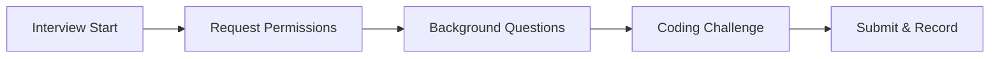
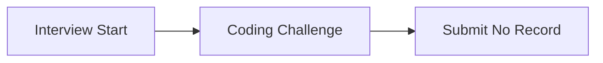

# Skip-to-Coding Feature

## Overview

The skip-to-coding feature allows developers and testers to bypass the background interview phase and jump directly to the coding challenge. This significantly speeds up testing workflows during development.

## Usage

### URL Parameter
```
/interview?skipToCoding=true
```

### Behavior
1. Skips microphone/camera permission requests
2. Bypasses background question phase
3. Jumps directly to coding IDE
4. Disables screen recording (prevents recording permission prompt)
5. Maintains full coding evaluation functionality

## Implementation

### Interview Page
**File**: `app/(features)/interview/page.tsx`

```typescript
const searchParams = useSearchParams();
const skipToCoding = searchParams.get("skipToCoding") === "true";

useEffect(() => {
  if (skipToCoding) {
    // Force coding mode immediately
    dispatch(forceCoding());
  }
}, [skipToCoding]);
```

### State Machine
**File**: `shared/state/slices/interviewMachineSlice.ts`

```typescript
export const forceCoding = createAction("interviewMachine/forceCoding");

reducers: {
  forceCoding: (state) => {
    state.state = "in_coding_session";
    state.isPageLoading = false;
  }
}
```

### Recording Bypass
**File**: `app/(features)/interview/components/InterviewIDE.tsx`

```typescript
const shouldRecord = !skipToCoding;

// Conditional recording start
if (shouldRecord) {
  await startRecording();
}

// Conditional recording stop
if (shouldRecord) {
  await stopRecording();
}
```

## Use Cases

### 1. Development Testing
Quickly test coding evaluation without waiting through background phase.

```bash
# Test coding submission
open http://localhost:3000/interview?skipToCoding=true
```

### 2. Debug Coding Features
Focus on coding-specific functionality:
- Code editor behavior
- Evaluation pipeline
- Scoring calculation
- OpenAI integration

### 3. Demo Preparation
Prepare demo environment with code pre-loaded:
```bash
# Skip to coding, pre-fill editor
http://localhost:3000/interview?skipToCoding=true&demo=true
```

### 4. Integration Testing
E2E tests can bypass slow background phase:
```typescript
// Playwright/Cypress test
await page.goto('/interview?skipToCoding=true');
await page.fill('textarea', codeSnippet);
await page.click('button:has-text("Submit")');
```

## Limitations

### Recording Not Available
- Screen recording disabled when skip-to-coding enabled
- Video evidence not captured
- Playback features won't work
- CPS video player shows "No video available"

**Rationale**: Recording permission prompt blocks automated testing

### Background Evaluation Missing
- Experience category scores will be N/A
- Final score calculation only uses coding dimension
- Score breakdown won't show experience component

### Session Data
```json
{
  "backgroundSummary": null,
  "codingSummary": { /* normal */ },
  "workstyleMetrics": { /* normal */ },
  "recordingUrl": null
}
```

## Architecture Impact

### Normal Flow


### Skip-to-Coding Flow


## Configuration

### Environment Variables
None required. Feature controlled by URL parameter only.

### Feature Flag (Future)
Could add persistent preference:
```typescript
// User settings
{
  "developerMode": {
    "skipToCodingByDefault": true
  }
}
```

## Testing Strategy

### Manual Testing
1. Start interview normally
2. Verify background phase works
3. Start interview with `?skipToCoding=true`
4. Verify jumps to coding immediately
5. Submit code and verify evaluation works
6. Check CPS shows coding scores only

### Automated Testing
```typescript
// test/skip-to-coding.spec.ts
describe('Skip to Coding', () => {
  it('should bypass background phase', async () => {
    await page.goto('/interview?skipToCoding=true');
    await expect(page.locator('[data-testid="code-editor"]')).toBeVisible();
    await expect(page.locator('[data-testid="background-prompt"]')).not.toBeVisible();
  });
  
  it('should disable recording', async () => {
    await page.goto('/interview?skipToCoding=true');
    // Should NOT see recording permission prompt
    await expect(page.locator('text="Allow screen recording"')).not.toBeVisible();
  });
});
```

## Security Considerations

### Not a Bypass
- Does not skip authentication
- Does not bypass scoring
- Full evaluation still runs
- Results stored normally

### Production Use
Safe to use in production for:
- Internal testing accounts
- Demo environments
- Candidate retakes (skip background if already completed)

**Not recommended for**:
- First-time candidate interviews
- Official assessment sessions
- Scenarios requiring full evaluation

## Future Enhancements

### Skip Options
```
?skipToCoding=true&skipRecording=false
```
Allow coding phase but keep recording.

### Pre-fill Code
```
?skipToCoding=true&template=react-hooks
```
Load specific code template.

### Time Limits
```
?skipToCoding=true&duration=300
```
Set custom coding duration (seconds).

### Resume Mode
```
?skipToCoding=true&sessionId=abc123
```
Resume existing session at coding phase.

## Related Features

### Demo Mode
**File**: `app/(features)/demo/`

Similar concept but for full demo flow:
- Pre-seeded data
- Guided walkthrough
- Skip authentication

### Debug Mode
**File**: `app/shared/components/Header.tsx`

Purple debug icon for inspecting state:
- View evaluation results
- Check score calculations
- Inspect API responses

## Troubleshooting

### Issue: Still seeing background phase
**Solution**: Check URL has `?skipToCoding=true` (case-sensitive)

### Issue: Recording prompt appears
**Solution**: Recording should auto-disable. Check `InterviewIDE.tsx` logic.

### Issue: Score calculation fails
**Solution**: Expected. Background scores will be null. Check CPS handles gracefully.

### Issue: Session not saving
**Solution**: Ensure session creation still happens even without background phase.

## Code Locations

- URL parameter parsing: `app/(features)/interview/page.tsx`
- State machine action: `shared/state/slices/interviewMachineSlice.ts`
- Recording bypass: `app/(features)/interview/components/InterviewIDE.tsx`
- Score handling: `app/shared/utils/calculateScore.ts`

