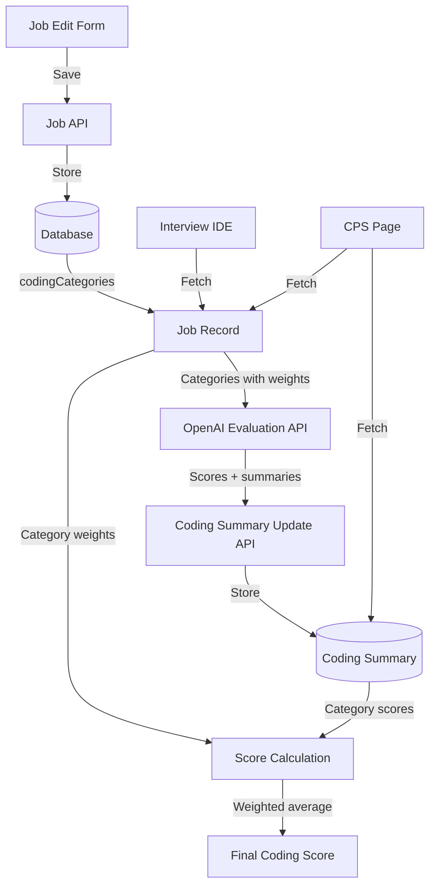

# Job-Specific Coding Categories

## Overview

The Job-Specific Coding Categories system allows companies to define custom evaluation criteria for coding interviews that align with specific job requirements. Instead of using fixed, hardcoded categories, each job can have its own set of weighted evaluation dimensions.

## Architecture

### Database Schema

**Job Model** (`server/prisma/schema.prisma`)
```prisma
model Job {
  // ... existing fields
  codingCategories Json?  // Array of {name, description, weight}
}
```

The `codingCategories` field stores an array of category objects:
```json
[
  {
    "name": "TypeScript Proficiency",
    "description": "Type safety, interfaces, generics usage",
    "weight": 33
  },
  {
    "name": "React Best Practices",
    "description": "Component composition, hooks usage, lifecycle management",
    "weight": 33
  },
  {
    "name": "Performance Optimization",
    "description": "Code splitting, lazy loading, rendering optimization",
    "weight": 34
  }
]
```

**CodingSummary Model** (`server/prisma/schema.prisma`)
```prisma
model CodingSummary {
  // ... existing fields
  jobSpecificCategories Json?  // Evaluation results: {categoryName: {score, text, description}}
}
```

The `jobSpecificCategories` field stores evaluation results:
```json
{
  "TypeScript Proficiency": {
    "score": 85,
    "text": "Demonstrates strong understanding of TypeScript...",
    "description": "Type safety, interfaces, generics usage"
  },
  "React Best Practices": {
    "score": 70,
    "text": "Good use of hooks, could improve component composition...",
    "description": "Component composition, hooks usage, lifecycle management"
  }
}
```

### Data Flow



## Key Components

### 1. Job Edit Form UI

**File**: `app/(features)/company-dashboard/jobs/[jobId]/page.tsx`

**Location**: Scoring Configuration > Coding Dimensions > Job-Specific Categories

**Features**:
- Add/edit/remove categories inline
- Real-time weight validation (must sum to 100%)
- Minimal, Apple-inspired card design
- Each category has:
  - Name (e.g., "TypeScript Proficiency")
  - Description (e.g., "Type safety, interfaces, generics usage")
  - Weight (percentage, 0-100)

**State Management**:
```typescript
const [codingCategories, setCodingCategories] = useState<CodingCategory[]>([]);

interface CodingCategory {
  name: string;
  description: string;
  weight: number;
}
```

### 2. Evaluation Pipeline

#### Step 1: Interview Submission
**File**: `app/(features)/interview/components/InterviewIDE.tsx`

When candidate submits code:
1. Fetch job-specific categories from `job.codingCategories`
2. Call `/api/interviews/evaluate-job-specific-coding` with:
   - `finalCode`: The candidate's submitted code
   - `codingTask`: The coding prompt
   - `categories`: Array from job definition

#### Step 2: OpenAI Evaluation
**File**: `app/api/interviews/evaluate-job-specific-coding/route.ts`

OpenAI evaluates each category:
```typescript
// Prompt structure
{
  systemPrompt: `
    Evaluate code against:
    - Category 1: Description
    - Category 2: Description
    
    Provide score (0-100) and 2-3 sentence explanation for each.
  `,
  model: "gpt-4o",
  response_format: { type: "json_object" }
}
```

Returns:
```json
{
  "categories": {
    "Category Name": {
      "score": 85,
      "text": "Evaluation summary..."
    }
  }
}
```

#### Step 3: Store Results
**File**: `app/api/interviews/session/[sessionId]/coding-summary-update/route.ts`

Enriches results with descriptions and stores in `CodingSummary.jobSpecificCategories`:
```typescript
const enrichedCategories = {
  [categoryName]: {
    score: evaluationScore,
    text: evaluationText,
    description: categoryDefinition.description
  }
};
```

### 3. Score Calculation

**File**: `app/shared/utils/calculateScore.ts`

```typescript
interface RawScores {
  categoryScores: Array<{
    name: string;
    score: number;
    weight: number;
  }>;
}

// Calculate weighted average
const codingScore = sum(score × weight) / sum(weights)
```

**Example**:
- Category 1: score=80, weight=33% → 80 × 33 = 2640
- Category 2: score=70, weight=33% → 70 × 33 = 2310
- Category 3: score=90, weight=34% → 90 × 34 = 3060
- **Total**: (2640 + 2310 + 3060) / 100 = **80.1**

### 4. CPS Display

**File**: `app/(features)/cps/components/WorkstyleDashboard.tsx`

Displays each category as a metric row:
- Category name
- Description (from job definition)
- Score with visual indicator
- "View Analysis" button opens modal with detailed text

**File**: `app/(features)/cps/page.tsx`

Fetches both job and coding summary to combine:
- Category definitions (from job)
- Category scores (from coding summary)
- Calculates final score using weights

## API Endpoints

### GET `/api/company/jobs/[jobId]`
Returns job with `codingCategories` field.

**Helper**: `app/api/company/jobs/jobHelpers.ts`
```typescript
export function mapJobResponse(job) {
  return {
    // ... other fields
    codingCategories: job.codingCategories
  };
}
```

### POST `/api/interviews/evaluate-job-specific-coding`
Evaluates code against categories using GPT-4o.

**Input**:
```json
{
  "finalCode": "...",
  "codingTask": "...",
  "categories": [{name, description, weight}]
}
```

**Output**:
```json
{
  "categories": {
    "Category Name": {
      "score": 85,
      "text": "..."
    }
  }
}
```

### PATCH `/api/interviews/session/[sessionId]/coding-summary-update`
Updates `CodingSummary.jobSpecificCategories`.

**Input**:
```json
{
  "jobSpecificCategories": {
    "Category Name": {
      "score": 85,
      "text": "...",
      "description": "..."
    }
  }
}
```

### GET `/api/interviews/session/[sessionId]/coding-summary`
Returns coding summary including `jobSpecificCategories`.

### GET/POST `/api/interviews/session/[sessionId]/code-quality-analysis`
Returns/generates detailed analysis including job-specific categories.

## Extending the System

### Adding a New Job

1. Navigate to job edit form
2. Scroll to "Scoring Configuration" > "Coding Dimensions"
3. Click "+ Add Category"
4. Fill in:
   - Name: User-facing category name
   - Description: What the category measures
   - Weight: Percentage (must sum to 100% across all categories)
5. Save job

### Modifying Evaluation Logic

**To change OpenAI prompt**:
Edit `app/api/interviews/evaluate-job-specific-coding/route.ts`:
```typescript
const systemPrompt = `
  // Your custom evaluation instructions
  // Reference: ${categoryList}
`;
```

**To change scoring scale**:
Update scoring guidelines in the same file:
```typescript
**Scoring Guidelines:**
- 90-100: Your criteria
- 75-89: Your criteria
// ...
```

### Adding Category Presets

**File**: `server/db-scripts/seed-data.ts`

Add preset categories for different job types:
```typescript
const FRONTEND_CATEGORIES = [
  { name: "TypeScript Proficiency", description: "...", weight: 33 },
  { name: "React Best Practices", description: "...", weight: 33 },
  { name: "Performance Optimization", description: "...", weight: 34 }
];

const BACKEND_CATEGORIES = [
  { name: "API Design", description: "...", weight: 40 },
  { name: "Database Optimization", description: "...", weight: 30 },
  { name: "Security Practices", description: "...", weight: 30 }
];
```

### Customizing Display

**CPS Metric Rows**: Edit `app/(features)/cps/components/WorkstyleDashboard.tsx`

**Code Quality Modal**: Edit `app/(features)/cps/components/CodingSummaryOverlay.tsx`

## Migration from Legacy System

The system previously used hardcoded categories:
- `codeQualityWeight`: Fixed weight for code quality
- `problemSolvingWeight`: Fixed weight for problem solving
- Static categories defined in code

**Migration steps**:
1. Database migration added `codingCategories` to Job
2. Removed obsolete fields from schema
3. Updated scoring calculation to use dynamic weights
4. Deleted hardcoded constants file
5. Updated all UI components to display dynamic categories

**Backward Compatibility**:
- Jobs without `codingCategories`: Display shows no categories
- Evaluation APIs handle empty category arrays gracefully
- Score calculation defaults to 0 if no categories defined

## Debug Tools

### Debug Panel
**Location**: Main header (purple icon next to avatar)

Shows:
- **Coding Scores**: All job-specific category scores
- **Calculated Average**: Average of all category scores
- **Raw JSON**: Full `codingSummary.jobSpecificCategories` object

**File**: `app/(features)/cps/components/CPSDebugPanel.tsx`

### Interview Debug Panel
**Location**: Interview page, "Test Evaluation" button

Shows:
- Job-specific categories response
- Raw evaluation from OpenAI
- Individual category scores and texts

**File**: `app/(features)/interview/components/debug/CodingEvaluationDebugPanel.tsx`

## Validation Rules

1. **Category names**: Must be unique within a job
2. **Weights**: Must be positive numbers
3. **Weight sum**: Must equal 100%
4. **Minimum categories**: 1 (no maximum, but UI warns if > 10)
5. **Description**: Optional but recommended for clarity

## Performance Considerations

- **Database**: `Json` fields are efficient for flexible schemas
- **OpenAI API**: Single call evaluates all categories
- **Frontend**: Categories render dynamically without code changes
- **Caching**: Job definitions cached in interview session

## Future Enhancements

- Category templates/library
- AI-suggested categories based on job description
- Historical comparison of category effectiveness
- Category-specific remediation suggestions
- Multi-language support for category names/descriptions

