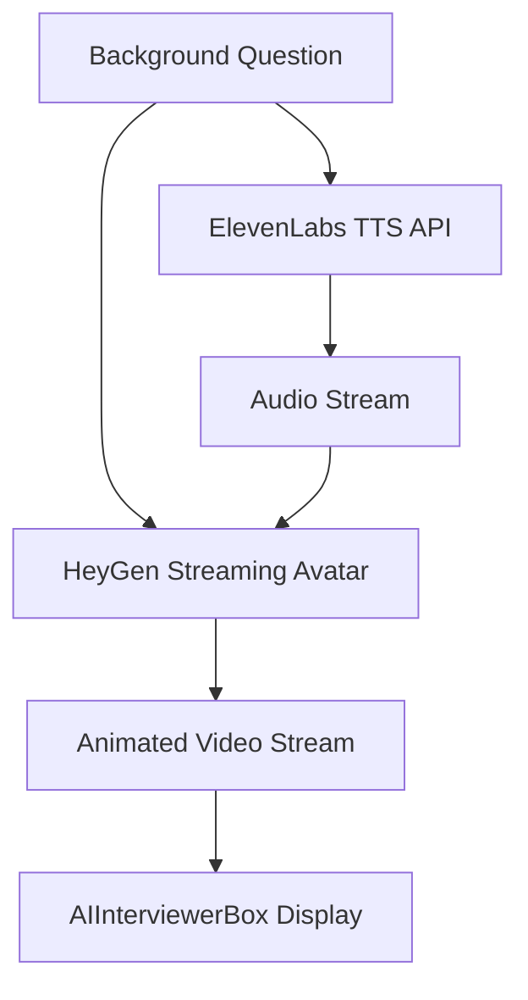

# HeyGen Streaming Avatar Integration

## Overview

Replace the static Sfinx avatar with HeyGen's real-time Streaming Avatar SDK, which provides high-quality lip-synced animations. This will animate `sfinx-avatar.png` during background interviews using your existing ElevenLabs TTS infrastructure.

## Architecture



## Implementation Steps

### 1. Install HeyGen Streaming Avatar SDK

Add HeyGen's SDK from their official repository:

```bash
pnpm add @heygen/streaming-avatar-sdk
```

Reference: [HeyGen Streaming Avatar SDK](https://github.com/HeyGen-Official/StreamingAvatarSDK)

### 2. Set Up HeyGen API Credentials

Add to environment variables:

- `HEYGEN_API_KEY` - Your HeyGen API token (get from Settings > API)
- Create Photo Avatar from `public/sfinx-avatar-nobg.png` in HeyGen dashboard
- Store avatar ID as `NEXT_PUBLIC_HEYGEN_AVATAR_ID`
- Client-side usage expects `NEXT_PUBLIC_HEYGEN_API_KEY` and `NEXT_PUBLIC_ELEVEN_LABS_CANDIDATE_VOICE_ID`

### 3. Create HeyGen Avatar Component

Build `app/(features)/interview/components/HeyGenAvatar.tsx`:

- Initialize HeyGen Streaming Avatar client
- Accept text input for speech
- Stream avatar video to canvas/video element
- Handle connection lifecycle (start/stop/pause)
- Integrate with ElevenLabs voice (HeyGen supports third-party voice providers)

Key features:

- Real-time streaming via WebRTC
- Synchronized lip movements with ElevenLabs audio
- Facial expressions and natural gestures
- Low-latency rendering

### 4. Update AIInterviewerBox Component

Modify [`app/(features)/interview/components/AIInterviewerBox.tsx`](app/\\(features)/interview/components/AIInterviewerBox.tsx):

- Replace static `` with `<HeyGenAvatar>` when interview is active
- Pass current question text to HeyGen component
- Handle loading states during avatar initialization
- Maintain existing animations (arrival, positioning)

### 5. Integrate with Background Interview Flow

**QuestionCard Integration** ([`app/(features)/interview/components/backgroundInterview/QuestionCard.tsx`](app/\\(features)/interview/components/backgroundInterview/QuestionCard.tsx)):

- Instead of separate TTS generation, pass question text to HeyGen
- HeyGen will handle both animation and audio via ElevenLabs integration
- Update audio state callbacks to work with HeyGen's streaming events

**AnnouncementScreen Integration** ([`app/(features)/interview/components/backgroundInterview/AnnouncementScreen.tsx`](app/\\(features)/interview/components/backgroundInterview/AnnouncementScreen.tsx)):

- Similar approach - pass announcement text to HeyGen
- Sync typing animation with HeyGen speech timing
- Handle preloaded content by caching HeyGen sessions

**Interview Page** ([`app/(features)/interview/page.tsx`](app/\\(features)/interview/page.tsx)):

- Initialize HeyGen session during preload phase
- Manage HeyGen connection state across interview stages
- Clean up HeyGen resources on unmount

### 6. Handle ElevenLabs Integration

HeyGen natively supports ElevenLabs voices:

- Configure ElevenLabs voice in HeyGen dashboard (one-time setup)
- Use existing `ELEVENLABS_API_KEY` and `ELEVEN_LABS_CANDIDATE_VOICE_ID`
- HeyGen will use your ElevenLabs voice for speech synthesis
- Keep `/api/tts` route as fallback for non-HeyGen contexts

### 7. Optimize for Performance

- **Preload**: Initialize HeyGen session during interview preload phase
- **Caching**: Cache HeyGen avatar initialization to reduce latency
- **Connection Management**: Maintain persistent WebRTC connection during background stage
- **Error Handling**: Fallback to static avatar if HeyGen fails
- **Network**: Monitor connection quality and adjust streaming quality

## Technical Integration Details

### HeyGen SDK Usage Pattern

```typescript
import { StreamingAvatarSDK } from '@heygen/streaming-avatar-sdk';

const avatar = new StreamingAvatarSDK({
  apiKey: process.env.HEYGEN_API_KEY,
  avatarId: process.env.NEXT_PUBLIC_HEYGEN_AVATAR_ID,
});

// Initialize streaming session
await avatar.startSession({
  voice: {
    provider: 'elevenlabs',
    voiceId: process.env.ELEVEN_LABS_CANDIDATE_VOICE_ID,
  },
});

// Speak with lip sync
await avatar.speak(questionText);
```

### Data Flow

1. Question generated → Pass to HeyGen
2. HeyGen calls ElevenLabs internally → Gets audio
3. HeyGen generates video with lip sync → Streams to client
4. Display animated avatar in AIInterviewerBox

## Scope

- **In Scope**: Background interview stage (QuestionCard, AnnouncementScreen)
- **Out of Scope**: Coding interview stage (keep existing behavior)

## Constitution Compliance

- **Library-First**: Using mature HeyGen SDK instead of custom implementation
- **No Hidden Fallbacks**: Explicit error handling with static avatar fallback
- **Logging**: All HeyGen events logged via `app/shared/services/logger.ts`
- **Modularity**: Self-contained HeyGenAvatar component
- **Documentation**: All functions documented per Section IV

## Risks & Mitigations

- **Latency**: HeyGen adds 1-2s initialization; mitigate via preload
- **Network**: Streaming requires stable connection; show loading states
- **Cost**: HeyGen charges per streaming minute; monitor usage
- **Fallback**: Keep static avatar as fallback if HeyGen unavailable
