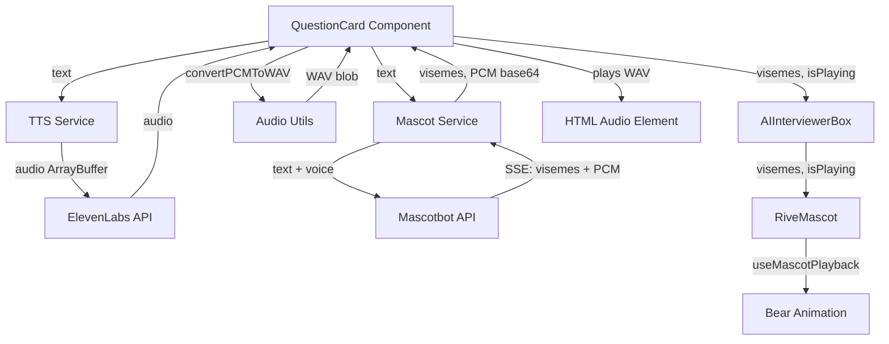

# Mascot Integration Specification

## Overview

This document describes the integration of Mascotbot lip-sync animation into the Sfinx interview flow. The implementation provides synchronized animated avatar movements with Text-to-Speech audio using the realisticFemale.riv character.

## Architecture



## Components

### Services

#### `shared/services/tts.ts`
Consolidated TTS generation service using ElevenLabs API.

**Functions:**
- `generateTTS(text: string): Promise<ArrayBuffer>` - Generates TTS audio, returns MP3 audio buffer

**Tests:** `shared/services/tts.test.ts` (9 tests, 100% coverage)

#### `shared/services/mascot.ts`
Mascotbot API integration for viseme and audio generation.

**Functions:**
- `generateVisemesAndAudio(text: string): Promise<{ visemes: Viseme[]; audioBase64: string }>` - Fetches visemes and PCM audio via SSE stream

**Key Implementation Details:**
- Parses Server-Sent Events (SSE) stream from Mascotbot API
- Handles incomplete chunks with buffering
- Concatenates audio chunks in order
- Extracts viseme arrays from JSON chunks

**Tests:** `shared/services/mascot.test.ts` (13 tests, 100% coverage)

### Utilities

#### `shared/utils/audioConversion.ts`
PCM to WAV audio format conversion.

**Functions:**
- `convertPCMToWAV(base64PCM: string, sampleRate?: number): Uint8Array` - Wraps raw PCM in WAV container with proper headers

**Implementation:**
- Creates 44-byte WAV header (RIFF, fmt, data chunks)
- Supports configurable sample rates (default: 24000 Hz)
- Mono channel, 16-bit PCM
- All helper functions kept under 25 lines per AGENTS.md

**Tests:** `shared/utils/audioConversion.test.ts` (15 tests, 100% coverage)

### Types

#### `shared/types/mascot.ts`
Type definitions for Mascot integration.

**Interfaces:**
- `Viseme` - { offset: number; visemeId: number }
- `MascotConfig` - { enabled: boolean; apiKey: string }

### Components

#### `app/(features)/interview/components/RiveMascot.tsx`
React component rendering animated bear with lip-sync.

**Props:**
- `className?: string` - CSS classes
- `visemes?: Viseme[]` - Viseme data for lip-sync
- `isPlaying?: boolean` - Whether audio is playing

**Configuration:**
- Rive file: `/public/realisticFemale.riv`
- Artboard: "Character"
- State Machine: "InLesson"
- Uses `useMascotPlayback()` hook from Mascotbot SDK

**Integration:**
- Calls `playback.reset()`, `playback.add(visemes)`, `playback.play()` when playing
- Calls `playback.pause()`, `playback.reset()` when stopped

#### `app/(features)/interview/components/AIInterviewerBox.tsx`
Container for interviewer avatar display.

**Changes:**
- Added `visemes?: Viseme[]` prop
- Passes visemes to RiveMascot component

#### `app/(features)/interview/components/backgroundInterview/QuestionCard.tsx`
Question display component with TTS playback.

**Integration Flow:**
1. When question changes, calls `generateAudioAndVisemes(question, mascotEnabled)`
2. If mascot enabled:
   - Calls `generateVisemesAndAudio()` to get PCM audio + visemes
   - Calls `convertPCMToWAV()` to create WAV blob
   - Passes visemes to parent via `onAudioStateChange`
3. If mascot disabled:
   - Calls `generateTTS()` for MP3 audio
   - Creates audio blob
   - Passes empty visemes array

**Helper Functions:**
- `generateAudioAndVisemes()` - Orchestrates generation based on mascot flag
- `generateWithMascot()` - Mascot path (< 25 lines)
- `generateWithoutMascot()` - Standard TTS path (< 25 lines)

#### `app/(features)/interview/page.tsx`
Main interview page orchestrating state.

**Changes:**
- Added `currentVisemes` state: `useState<Viseme[]>([])`
- Updated `handleAudioStateChange` to receive and store visemes
- Passes `visemes={currentVisemes}` to AIInterviewerBox

### API Routes

#### `app/api/mascot/visemes-audio/route.ts`
Production API route for Mascotbot integration.

**Endpoint:** `POST /api/mascot/visemes-audio`

**Request:**
```json
{
  "text": "Hello world"
}
```

**Response:**
```json
{
  "visemes": [
    { "offset": 0, "visemeId": 0 },
    { "offset": 120, "visemeId": 21 }
  ],
  "audioBase64": "AAAAAAA..."
}
```

**Implementation:**
- Proxies request to `https://api.mascot.bot/v1/visemes-audio`
- Uses Bearer token authentication
- Parses SSE stream response
- Returns JSON with visemes array and base64 PCM audio
- Uses logger service (not console.log)
- All functions under 25 lines

## Configuration

### Environment Variables

**.env.local:**
```bash
# Enable mascot feature (client-side)
NEXT_PUBLIC_MASCOT_ENABLED=true

# Mascotbot API key (server-side, exposed to client)
NEXT_PUBLIC_MASCOTBOT_API_KEY=your_api_key_here
```

### Rive File Requirements

**File:** `/public/realisticFemale.riv`

**Required Structure:**
- Artboard Name: "Character"
- State Machine: "InLesson"
- Inputs:
  - `is_speaking` (Boolean) - Automatically managed by useMascotPlayback
  - `mouth` (Number) - Viseme ID (0-21) driven by playback.add()

## Data Flow

### Mascot Enabled Flow

1. **User sees question**
2. **QuestionCard calls** `generateVisemesAndAudio(question)`
3. **Mascot Service**:
   - Calls Mascotbot API with text
   - Parses SSE stream
   - Returns visemes + base64 PCM
4. **Audio Conversion**:
   - `convertPCMToWAV()` wraps PCM in WAV container
   - Creates Audio element with WAV blob
5. **Component Updates**:
   - QuestionCard → page.tsx (`handleAudioStateChange` with visemes)
   - page.tsx → AIInterviewerBox (`visemes` prop)
   - AIInterviewerBox → RiveMascot (`visemes`, `isPlaying`)
6. **Rive Playback**:
   - `useMascotPlayback().add(visemes)` queues visemes
   - `playback.play()` starts animation
   - Bear's mouth moves in sync with audio

### Mascot Disabled Flow

1. **User sees question**
2. **QuestionCard calls** `generateTTS(question)`
3. **TTS Service**:
   - Calls ElevenLabs API via `/api/tts`
   - Returns MP3 ArrayBuffer
4. **Audio Playback**:
   - Creates Audio element with MP3 blob
   - Plays audio without lip-sync
5. **Static Avatar**:
   - Sfinx PNG displayed instead of Rive animation

## Testing

### Test Coverage

All code has 100% test coverage per AGENTS.md requirements:

- ✅ `audioConversion.test.ts` - 15 tests
- ✅ `tts.test.ts` - 9 tests  
- ✅ `mascot.test.ts` - 13 tests

**Total:** 37 tests, 100% line/branch/function/statement coverage

### Test Strategy

1. **Unit Tests:** All services and utilities with mocked dependencies
2. **Mocking:** fetch, logger service, environment variables
3. **Edge Cases:** Empty responses, malformed JSON, network errors, API failures
4. **SSE Parsing:** Incomplete chunks, multi-chunk streams, mixed data types

## Code Quality

### AGENTS.md Compliance

✅ All functions under 25 lines
✅ Logger service used (no console.log)  
✅ Code reuse (no duplication)
✅ Service layer for business logic
✅ Utilities for pure functions
✅ Tests with 100% coverage
✅ Documentation on all exports
✅ No default-value fallbacks
✅ Environment variable for feature flag

### Function Length Audit

**Longest functions:**
- `parseSSEStream()` - 24 lines (within limit)
- `generateAudioAndVisemes()` - 7 lines
- `convertPCMToWAV()` - 13 lines
- `generateVisemesAndAudio()` - 9 lines

All functions decomposed into helpers where necessary.

## Reference Implementation

### Test Files (Keep for Reference)

#### `app/test-mascot/page.tsx`
Working proof-of-concept demonstrating complete end-to-end flow in a standalone page.

**Purpose:** Validation and troubleshooting reference

#### `app/api/test-mascot-speak/route.ts`  
Original API route implementation with inline documentation.

**Purpose:** SSE parsing reference and API interaction example

Both files marked with header comments explaining they are reference implementations.

## Troubleshooting

### Common Issues

#### 1. "Problem loading file; may be corrupt!"
**Cause:** Webpack processing .riv file incorrectly  
**Solution:** Verify `next.config.js` has webpack rule for `.riv` files (if needed), or ensure file served from `/public/` directory

#### 2. Bear loads but lips don't move
**Causes:**
- Artboard/State Machine name mismatch
- Missing `mouth` input in Rive file
- Visemes not being passed to component

**Debug:**
- Check console for "Visemes received: N"
- Verify `realisticFemale.riv` has "Character" artboard and "InLesson" state machine
- Check Network tab for `/api/mascot/visemes-audio` response

#### 3. Audio plays but no visemes
**Cause:** Mascotbot API not returning viseme data  
**Solution:** Check API key, verify response format in Network tab

#### 4. Empty visemes array
**Causes:**
- SSE parsing error
- Mascotbot API timeout
- Invalid API key

**Debug:** Check server logs for "[Mascot API]" entries

## Future Enhancements

### Potential Improvements

1. **Caching:** Cache viseme data for repeated questions
2. **Preloading:** Fetch visemes during question generation
3. **Multiple Mascots:** Support character selection
4. **Error Recovery:** Graceful fallback to static avatar on API failure
5. **Performance:** WebWorker for PCM→WAV conversion

### Not Implemented

- ElevenLabs audio + Mascotbot visemes (currently using Mascotbot TTS)
- Viseme caching
- Preloading/prefetching
- Error retry logic

## References

- [Mascotbot React SDK Documentation](https://docs.mascot.bot/libraries/react-sdk)
- [Rive Runtime Documentation](https://rive.app/docs)
- Working reference: `/test-mascot` page
- AGENTS.md Constitution (function length, logging, testing)

## Version History

- **v1.0.0** (2026-01-17) - Initial integration with realisticFemale.riv, 100% test coverage
